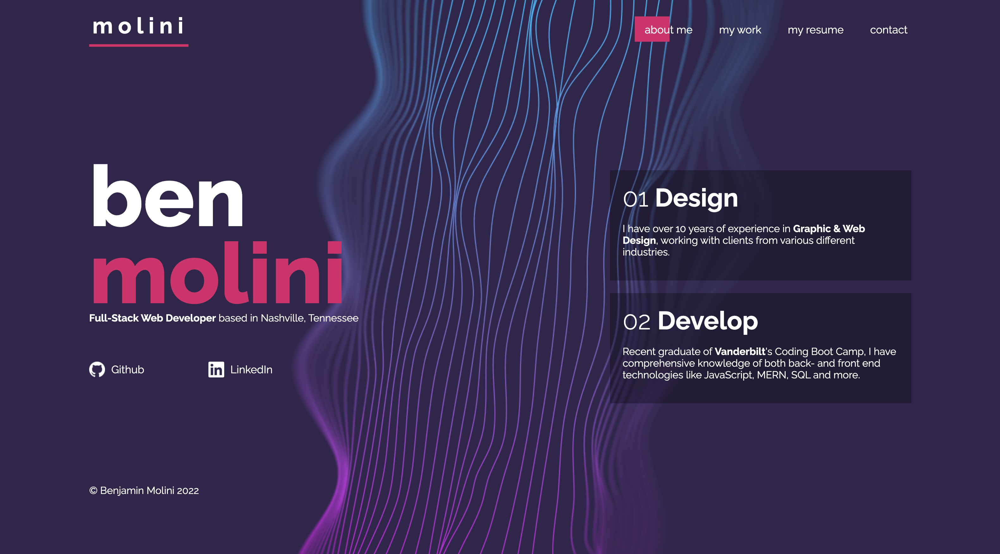

# Pro Portfolio

This is a portfolio that showcases my skills in both designing and developing websites. It's built with JavaScript using JSX, Node and React. I am also tapping into Raleway from Google Fonts.

The website has four sections: About me, My Work, My Resume and Contact. Pages are separated into their own components and rendered conditionally by React according to which the user clicks. 

All HTML and CSS is native and fully written by me, so the front end does not use any existing frameworks. The background image was created using Illustrator and Photoshop.

You can find the page live [here](http://d1sl.github.io/pro-portfolio/).

## Table of Contents
- [Installation](#installation)
- [Usage](#usage)

## Installation
You will need to have Node installed on your machine before installing this app. To install, run `npm install` or `npm i`.

## Usage
To run the app, use `npm start`. This will initialize the React development server and render the page. 

